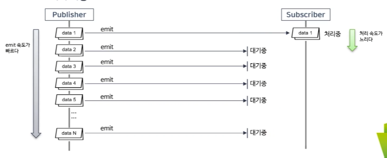
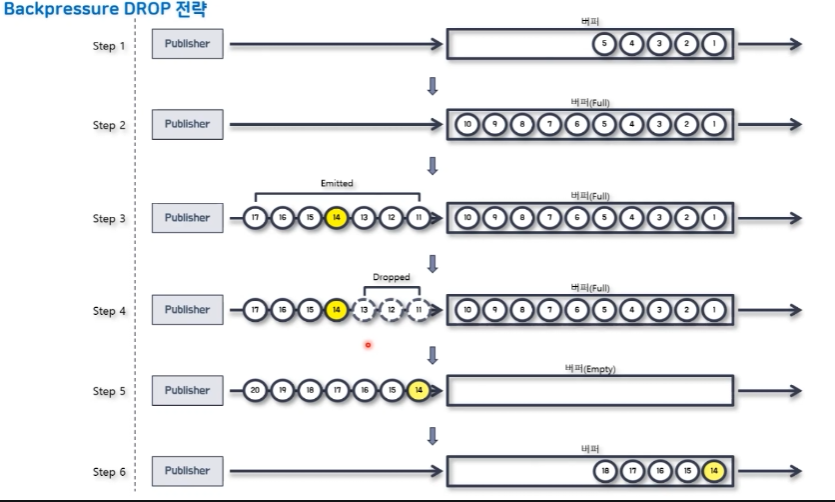
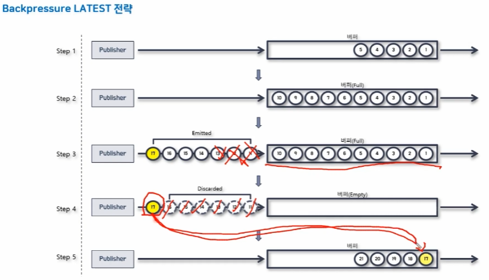
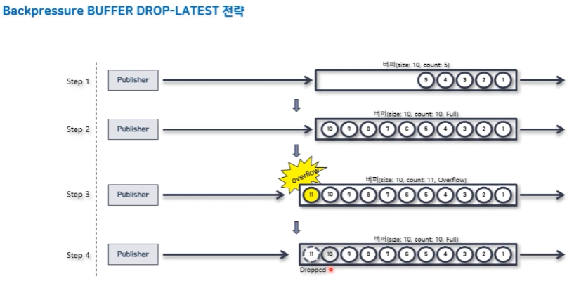
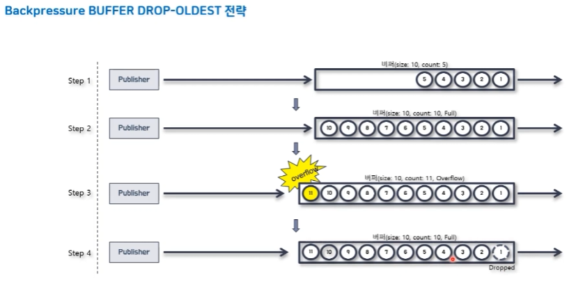

## [inflearn - Kevin의 알기 쉬운 Spring Reactive Web Applications: Reactor 1부](https://www.inflearn.com/course/spring-reactive-web-application-reactor1%EB%B6%80/dashboard)

---

### Reactor 용어정의

- Publisher: 발행자, 게시자, 생산자, 방출자(Emitter)
- Subscriber: 구독자, 소비자
- Emit: Publisher가 데이터를 내보내는것(방출하다, 내보내다, 통지하다)
- Sequence: Publisher가 emit하는 데이터의 연속적인 흐름을 저의 해 놓은 것. Operator 체인 형태로 정의
- Subscribe: Subscriber가 Sequence를 구독하는 것
- Dispose: Subscriber가 Sequence를 구독 해지 하는 것

---

### Mono

- 0개 또는 1개의 데이터를 emit하는 Publisher(Compare with RxJava Maybe)
- 데이터를 emit하는 과정에서 에러가 발생하면 onError signal을 emit한다.
- com.itvillage.section03.class01 패키지 참고

---

### Flux

- 0개 ~ N개의 데이터를 emit하는 Publisher이다.
- 데이터를 emit하는 과정에서 에러가 발생하면 onError signal을 emit한다.
- com.itvillage.section03.class01 패키지 참고

---

### Cold Sequence

- Subscribe 할때마다 타임라인이 새롭게 생성됨
- 이전에 emit된 데이터를 모두 받을 수 있음
- com.itvillage.section04.class01.ColdSequenceExample 클래스 참고

---

### Hot Sequence

- 타임라인이 하나만 생성됨
- Subscribe 한 시점 이후에 emit된 데이터만 받을 수 있음
- com.itvillage.section04.class01.HotSequenceExample 클래스 참고

---

### Publisher와 Subscriber 간의 프로세스
- subscriber가 publisher를 subscribe() 함
- publisher가 publisher에게 Send onSubscribe signal 구독이 정상적으로 이루어졌음을 전달
- subscriber가 데이터를 전달받기위해 publisher에게 request signal of N을 전달
- publisher는 전달받은 request signal of N에 해당되는 데이터를 전송(Send on Next sigal of N)하면서 데이터를 emit함
- publisher로 부터 전달받은 데이터 emit이 끝나면 subscriber가 다시 request signal of N을 전송하면서 반복
- publisher가 emit할 데이터가 없으면 Send onComplete signal을 subscriber에게 전달
- data를 emit하는 과정에서 error 발생 시 publisher가 publisher에게 on Error signal 전달 

---

### Backpressure란?
- 들어오는 데이터를 적절하게 제어해서 과부화 발생을 방지하는 기능
- `com.itvillage.section05.class01` 참고

[데이터 처리 병목현상 예시]

#### 해결방법
- Subscriber가 적절히 처리할 수 있는 수준의 데이터 개수를 Publisher에게 요청
  - Subscriber가 데이터를 처리완료하면 Publisher에게 처리할 데이터를 요청하여 받아오는 방식
- Backpressure 전략을 사용하는 방법
  - IGNORE 전략: Backpressure를 적용하지 않음
  - ERROR 전략: Downstream으로 전달할 데이터가 버퍼에 가득 찰 경우, Exception을 발생
  - DROP 전략: Downstream으로 전달할 데이터가 버퍼에 가득 찰 경우, 버퍼 밖에서 대기하는 먼저 emit된 데이터부터 Drop 시킴(drop된 데이터는 subscriber에게 전달되지 않음)
    - 
  - LATEST 전략: Downstream으로 전달할 데이터가 버퍼에 가득 찰 경우, 버퍼 밖에서 대기하는 가장 최근에 emit된(가장 나중에) 데이터부터 버퍼에 채움
    - 
  - BUFFER 전략: Downstream으로 전달할 데이터가 버퍼에 가득 찰 경우, 버퍼 안에 있는 데이터를 Drop 시키는 전략
    - DROP LATEST 전략: Downstream으로 전달할 데이터가 버퍼에 가득 찰 경우, 가장 최근에 들어온 데이터를 Drop 시킴
      - 
    - DROP OLDEST 전략: Downstream으로 전달할 데이터가 버퍼에 가득 찰 경우, 가장 나중에 들어온 데이터를 Drop 시킴
      - 